# Knox Key

**Project:** Knox Key FIDO2 Security Key  
**Start Date:** March 10, 2026, 5:40:58 PM  

---

## Work Log

| Minutes | Task | Details |
|-------:|------|---------|
| 60 | Research hardware security keys | 

Click to expand
Searched for good hardware security keys to understand the project goals. Started by looking at different types of security keys - FIDO2, U2F, etc. Watched videos and read articles about how they work and why they're important. Got inspired after doing a speech about security keys to actually build one myself. Looked at YubiKey, Titan keys, and other commercial options to understand features and design patterns.  Evidence: 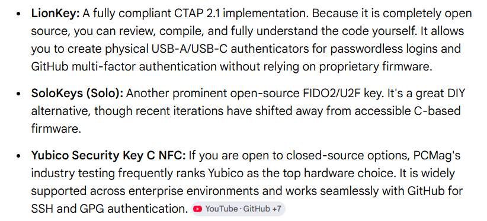
 |
| 75 | Research Lionkey | 

Click to expand
Deep dive into [Lionkey](https://lionkey.dev/) - an open source FIDO2 key project. Went through their website and repo, looked at their schematic, PCB layout, and firmware code. This was really helpful to understand what components I'd need and how to structure the project. Took notes on their component choices and design decisions.  Evidence: 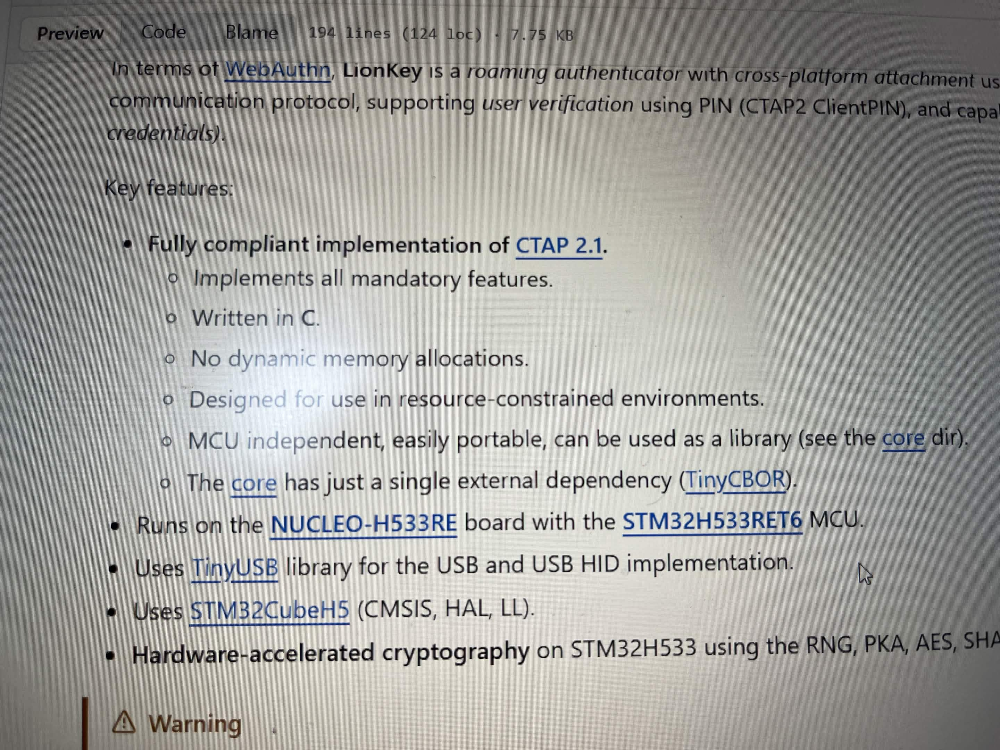
 |
| 5 | Started KiCad project | 

Click to expand
Created a new KiCad project file and set up the basic project structure. Configured project settings and added necessary libraries for components I'd be using.  Evidence: 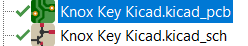
 |
| 30 | Researched microcontroller options | 

Click to expand
Looked at different MCU options that support FIDO2 and USB. Compared STM32F072, STM32L433, and some other options. Checked availability on JLCPCB and pricing. Made notes on memory, peripherals, and power consumption of each option.  Evidence: 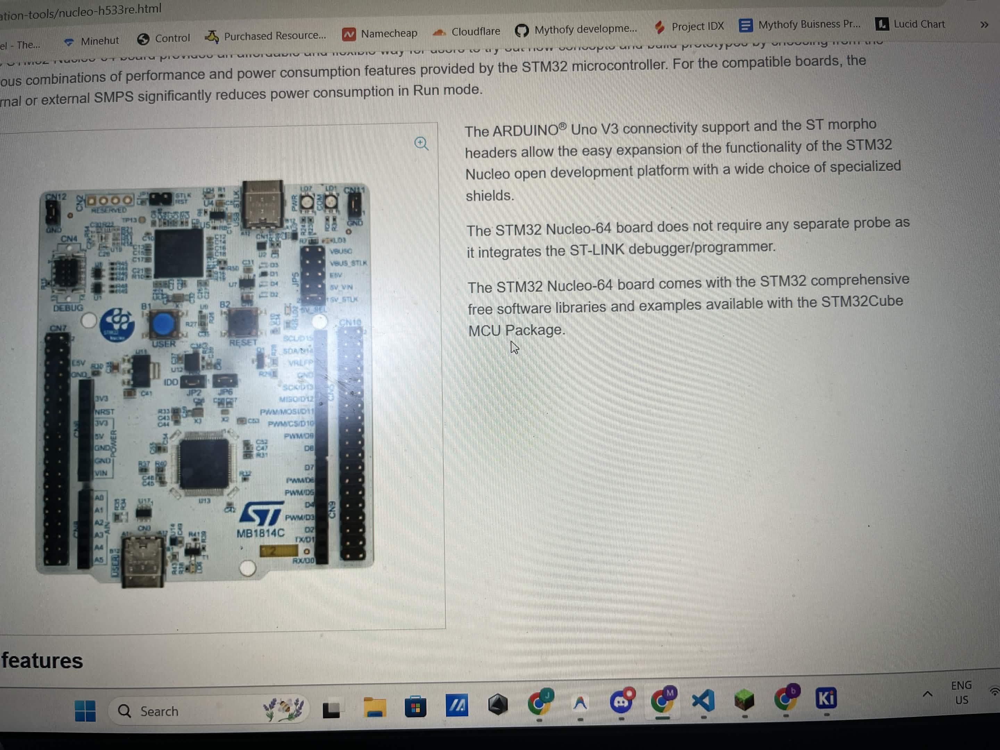
 |
| 15 | Selected STM32F072 as main MCU | 

Click to expand
Decided to go with the STM32F072 based on FIDO2 support, USB device capability, available SRAM for crypto operations, and good availability at JLCPCB. It had enough power for what I needed without being overkill.  Evidence: 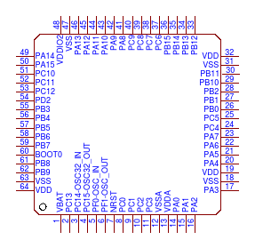
 |
| 30 | Found voltage regulators | 

Click to expand
Searched JLCPCB for a regulator for the 3.3V rail used by the MCU and support parts. Selected MCP1700T-3302E in SOT-23 for the final design and validated the required input/output capacitor setup from the datasheet.  Evidence: 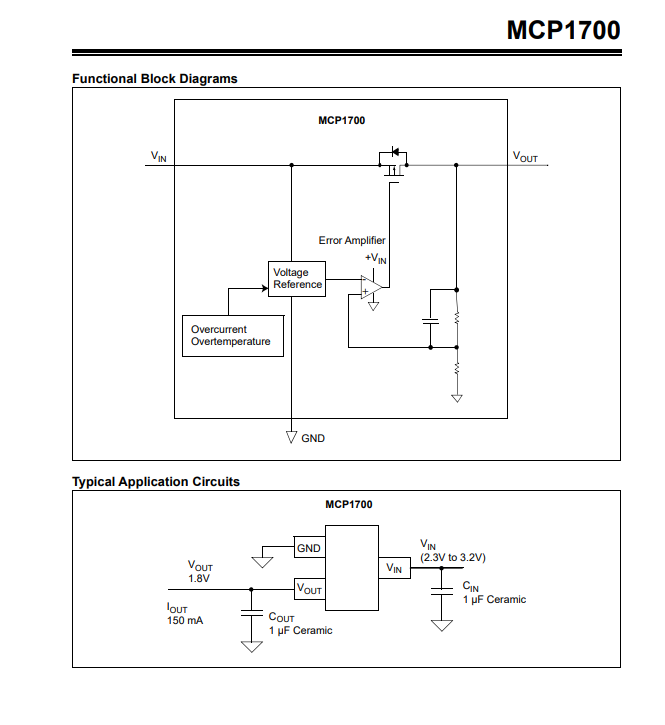
 |
| 21 | Selected crypto chip (ATECC608) | 

Click to expand
Found and selected the ATECC608 cryptographic coprocessor from Microchip. This handles the heavy crypto work for FIDO2 operations like ECDSA signing. Verified it was available and compatible with my MCU choice via I2C interface.  Evidence: 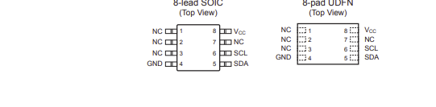
 |
| 24 | Picked USB connector and supporting components | 

Click to expand
Selected a USB Type-C connector and supporting protection/filter parts for the USB data path. Added USBLC6-2SC6 ESD protection and finalized the connector footprint for manufacturing-friendly assembly.  Evidence: 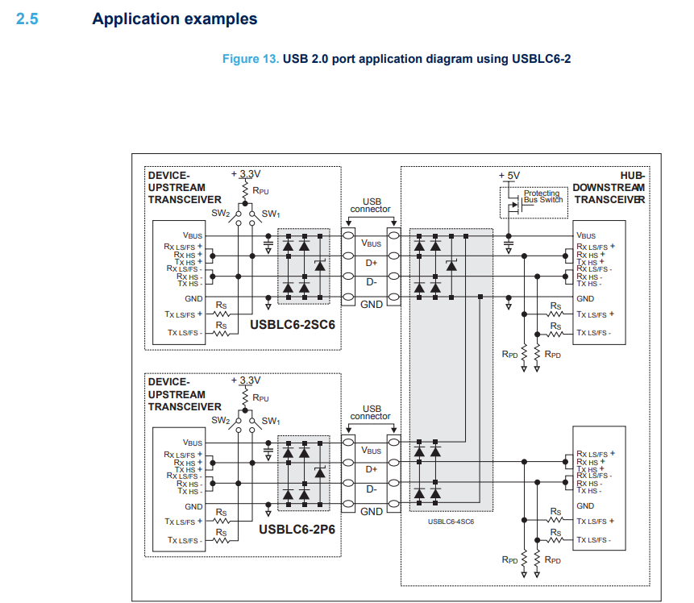
 |
| 30 | Gathered passive components | 

Click to expand
Created a list of all resistors and capacitors needed for filtering, pull-ups, and decoupling. Chose values from datasheets and selected assembly-friendly footprints. Kept placement single-side for full manufacturing (not hand soldering).  Evidence: 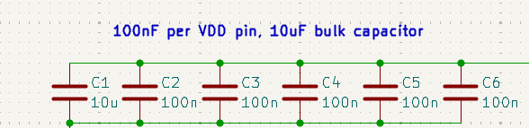
 |
| 3 | Generated BOM via KiCad plugin | 

Click to expand
Exported the BOM automatically using KiCad's BOM export plugin - quick automated export for part numbers and quantities.  Evidence: 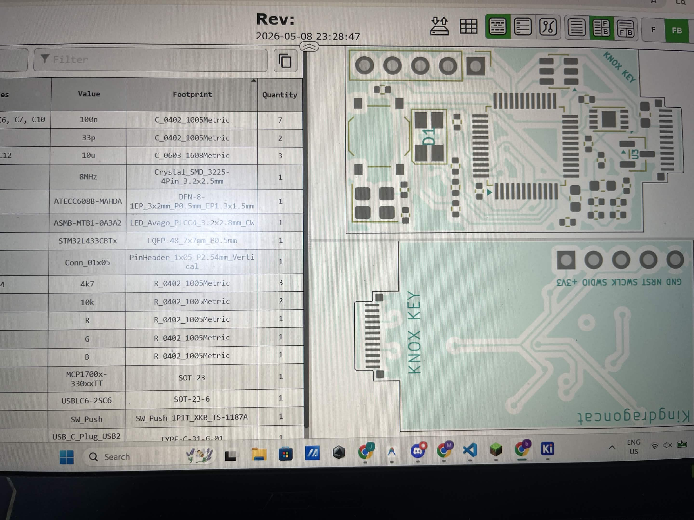
 |
| 120 | Drew main power supply circuit | 

Click to expand
Started the schematic by laying out the power supply section - the input stage with decoupling caps, the voltage regulator circuit, output filtering, and power distribution. Made sure to include all the recommended bypass capacitors from the regulator datasheet.  Evidence: 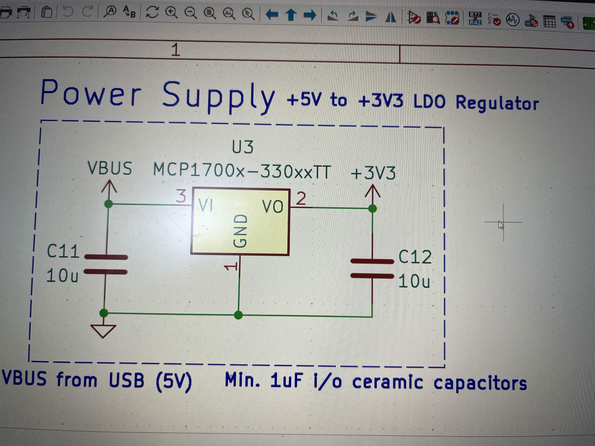
 |
| 90 | Drew USB interface and connector pins | 

Click to expand
Added the USB Type-C connector symbol and connected the signal lines. Set up the USB signal conditioning - series resistors for impedance matching, ferrite bead for filtering, and the proper pull-up configurations for VBUS sensing.  Evidence: 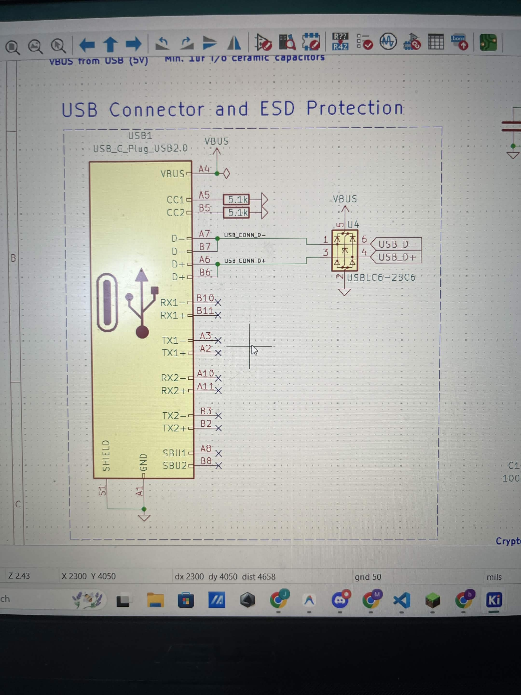
 |
| 60 | Drew MCU connections and decoupling | 

Click to expand
Placed the STM32F072 symbol and connected all the power pins, decoupling capacitors, bypass caps, and the crystal oscillator. This was frustrating at first but eventually got it looking decent. Made sure all the bypass caps were placed close to their respective power pins.  Evidence: 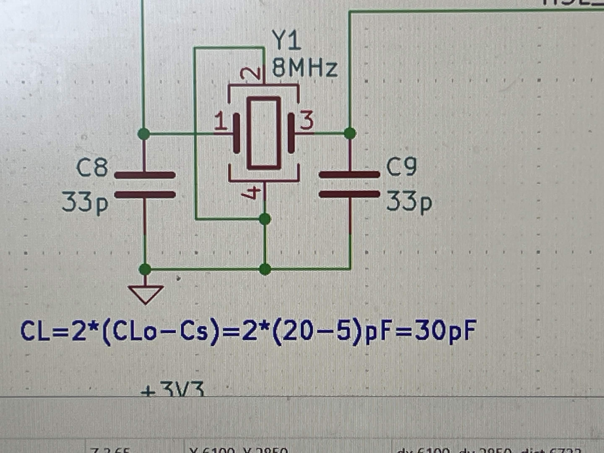
 |
| 45 | Added ATECC608 crypto chip circuit | 

Click to expand
Placed the ATECC608 symbol and connected the I2C bus (SDA/SCL lines), power, and ground. Added pull-up resistors on the I2C bus as required. Made sure this section had its own decoupling cap.  Evidence: 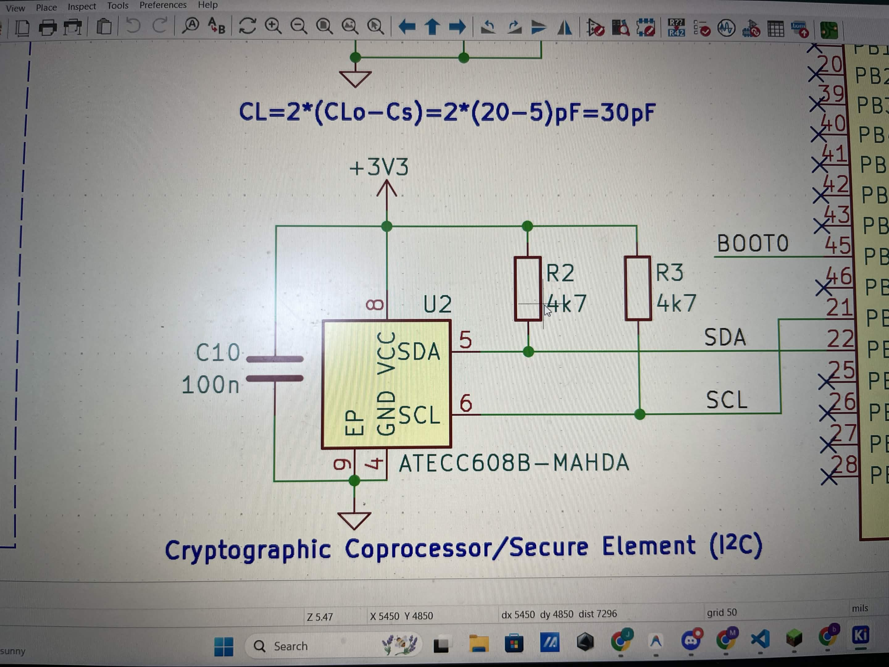
 |
| 30 | Added debug header and SWD connections | 

Click to expand
Added a SWD (Serial Wire Debug) connector header for firmware debugging and flashing. Wired up the SWDIO and SWDCK lines from the MCU to this header along with power and ground. This would be crucial for testing.  Evidence: 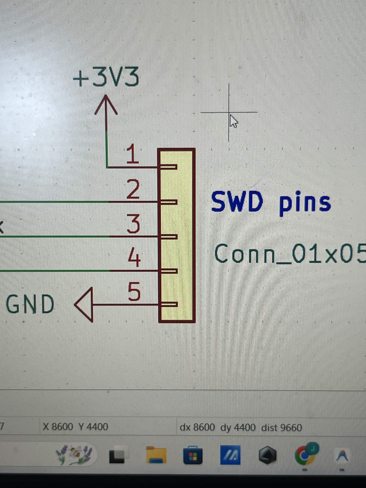
 |
| 30 | Added status LED circuit | 

Click to expand
Added an LED indicator circuit tied to MCU GPIO for status feedback while keeping the user presence button circuit in the design. Included the required resistor network and kept routing clear for assembly and debug visibility.  Evidence: 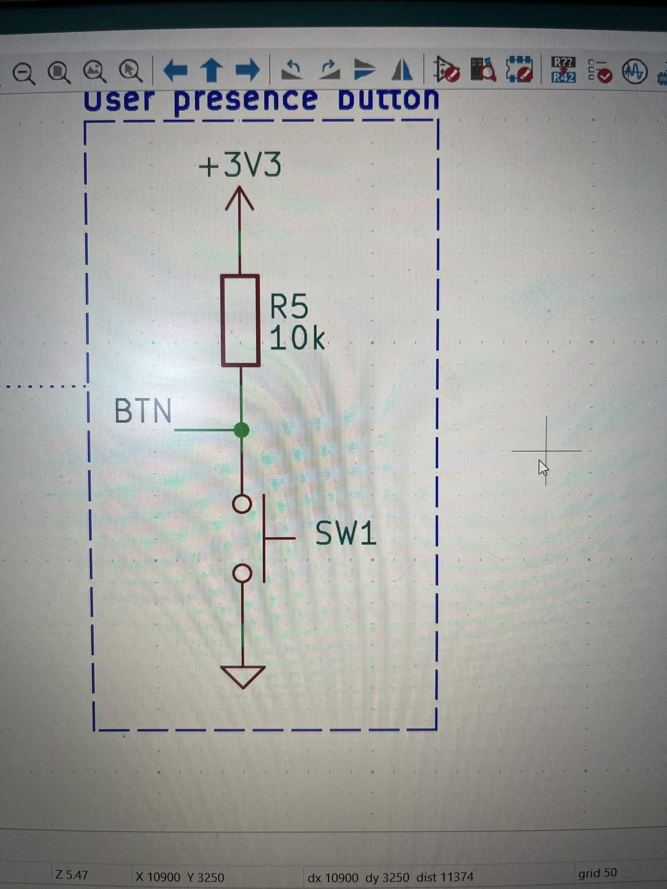
 |
| 15 | Cleaned up schematic layout | 

Click to expand
Reorganized the schematic to make it more readable - grouped related sections together, straightened up wires, and made sure the sheet looked professional. Did the first pass of checking for obvious issues.  Evidence: 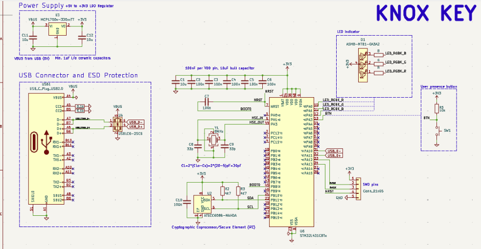
 |
| 15 | Ran ERC (Electrical Rules Check) | 

Click to expand
Ran KiCad's ERC tool to check for electrical rule violations. Fixed a few issues like missing values and unconnected pins. Made sure all components were properly referenced.  Evidence: 
 |
| 240 | PCB component placement and initial routing | 

Click to expand
This was tedious. Started by placing all components on the PCB trying to minimize form factor. Had to think carefully about where to put things - USB connector on one edge, MCU in the middle, crypto chip nearby for short I2C traces, power supply components grouped together. Then started routing the copper traces, prioritizing USB signal integrity and keeping crypto chip traces away from noise sources. Got most of the critical traces done but knew I'd have to refine this.  Evidence: 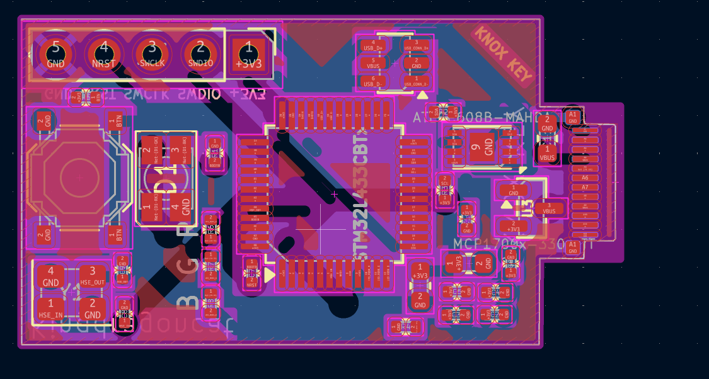
 |
| 150 | Routing tight connections and signal integrity | 

Click to expand
Continued routing, focusing on the tricky parts. Made sure USB differential pairs were routed together with controlled impedance. Tried to keep signal traces away from high-current power traces. Added via stitching where needed. This part honestly sucked - kept having to reroute things when they crossed badly. Did maybe 5 passes of optimization.  Evidence: 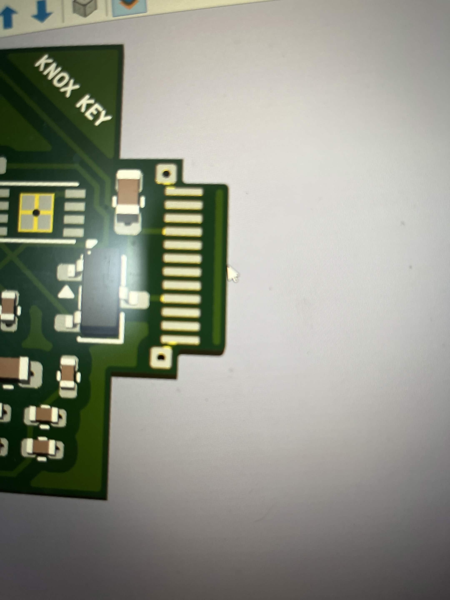
 |
| 60 | Added ground and power planes | 

Click to expand
Added copper pours for ground on the board layers to reduce noise and improve signal integrity. Added the 3.3V power distribution routing and verified clearances. These also help with thermal distribution.  Evidence: 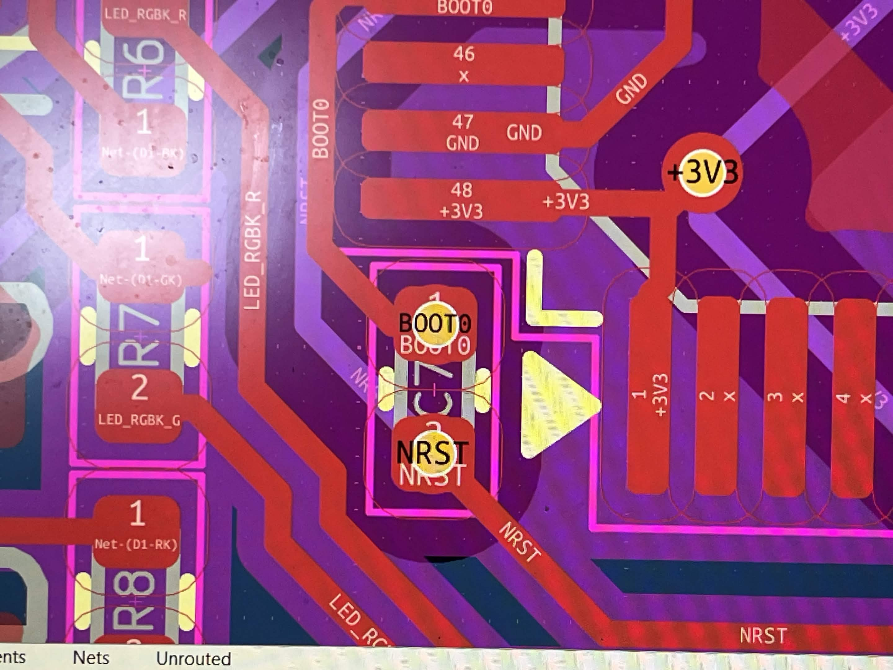
 |
| 40 | Replaced wired ground with ground splash | 

Click to expand
Initially routed ground as discrete traces across the board, then learned that a ground pour/splash is better for noise and manufacturing. Removed the wired ground traces and applied a ground splash — cost about 40 minutes of rework.  Evidence: 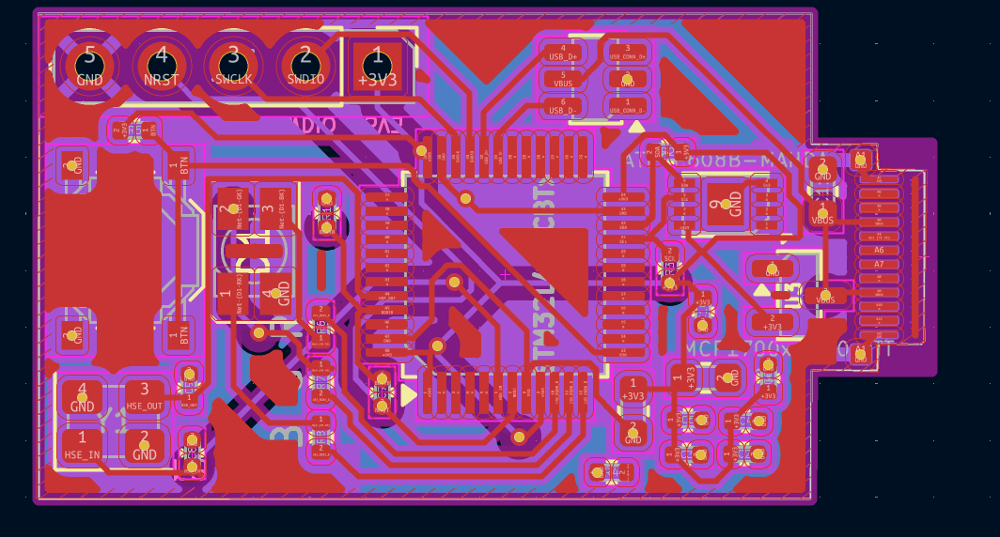
 |
| 90 | Design Rule Check and violation fixes | 

Click to expand
Ran DRC to check for spacing violations, trace width issues, and other manufacturing problems. Had to go back and fix several trace width violations and clearance issues. Adjusted a few vias that were too close together. Checked it like 5 times because I kept finding small issues.  Evidence: 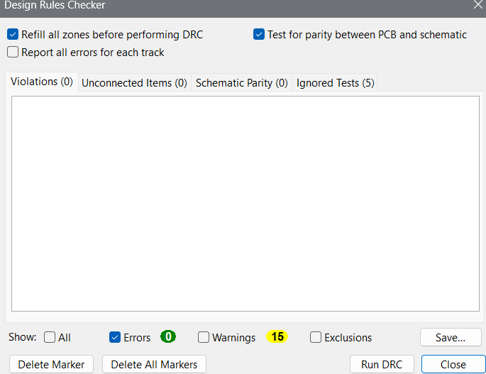
 |
| 120 | Attempted metal USB shroud modification | 

Click to expand
Decided the design needed a more robust USB connector with a metal shroud for durability. Started modifying the schematic and PCB layout to accommodate this. Swapped out the connector type, adjusted the footprint, and tried to reroute the USB signals to match the new connector pinout. About halfway through I realized I was creating way more complexity than necessary and the project got pretty messy.  Evidence: 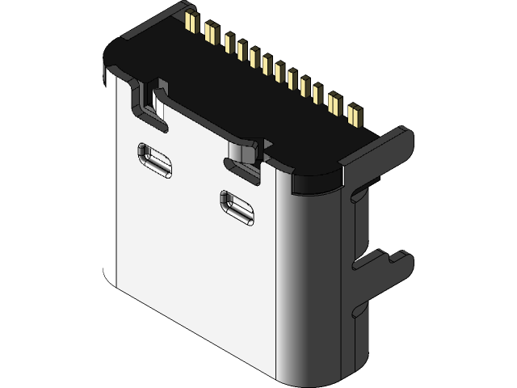
 |
| 60 | Project crashed - reverted to backup | 

Click to expand
While working on the metal shroud USB connector, KiCad crashed (not sure if it was a memory issue or file corruption). Lost about 30 mins of work. Had to revert to the backup version from earlier. This was frustrating but thankfully I had backups in the _restore_tmp folder.  Evidence: 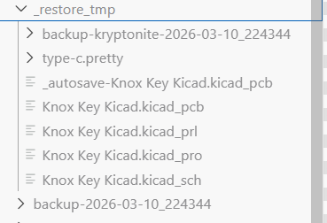
 |
| 60 | Redid PCB work after revert | 

Click to expand
After reverting, I had to redo all the PCB modifications I'd made for the metal shroud. Re-ran DRC, fixed the same violations again, and got back to the state I was at before the crash. This was annoying repetitive work.  Evidence: 
 |
| 30 | Decided to keep original USB connector | 

Click to expand
Realized that the metal shroud was adding unnecessary complexity and manufacturing costs for not much benefit. Decided to stick with the original simple USB Type-C connector design. Removed all the partial changes related to the metal shroud and got back to the clean version.  Evidence: 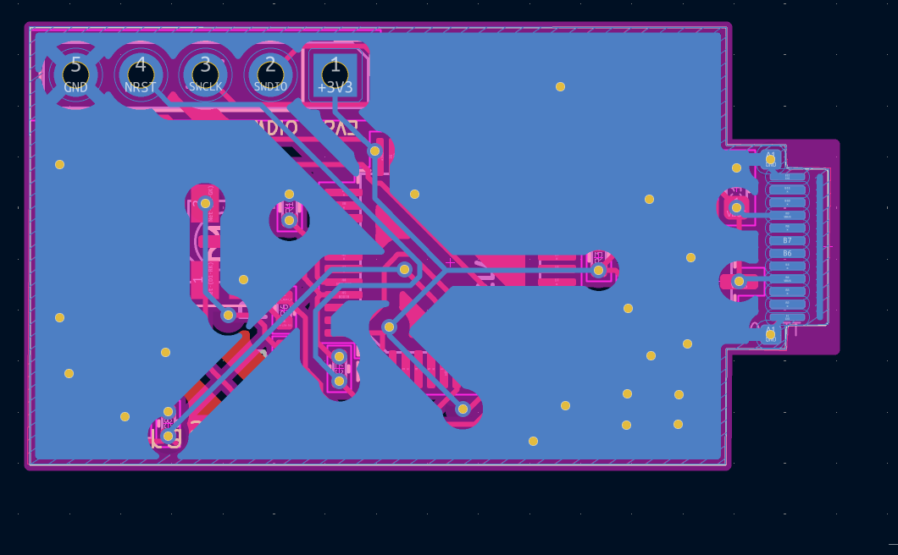
 |
| 30 | Slack fixes & error corrections | 

Click to expand
Posted design on Hack Club Slack, received feedback (e.g., RGB LED was wired to GND instead of 3.3V). Fixed those wiring errors and small issues based on community feedback. This took about 30 minutes to correct and re-run DRC.  Evidence: 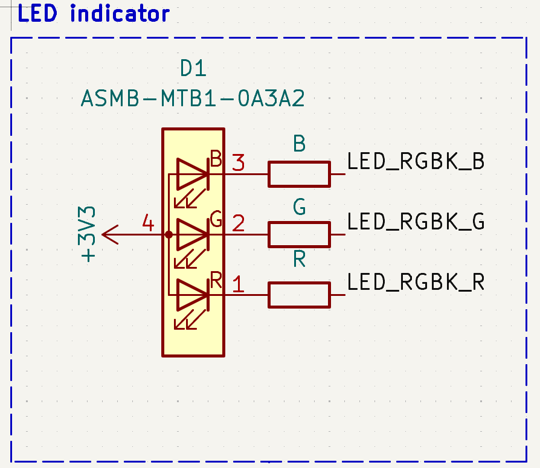
 |
| 120 | Generated manufacturing files | 

Click to expand
Exported Gerber files for all layers (F_Cu, B_Cu, F_Mask, B_Mask, F_Silk, B_Silk, Edge_Cuts, F_Fab). Generated drill files and the CPL (Component Placement List). BOM was exported via KiCad plugin (automated).  Evidence: 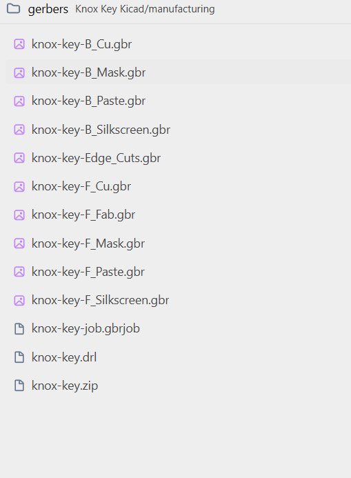
 |
| 30 | Exported 3D model and visual check | 

Click to expand
Exported a 3D STEP file and rendered a 3D view of the board to visually verify everything looked right. Checked that no components were colliding, traces looked clean, and overall the design was sound. The 3D view helped catch a few small issues I'd missed.  Evidence: 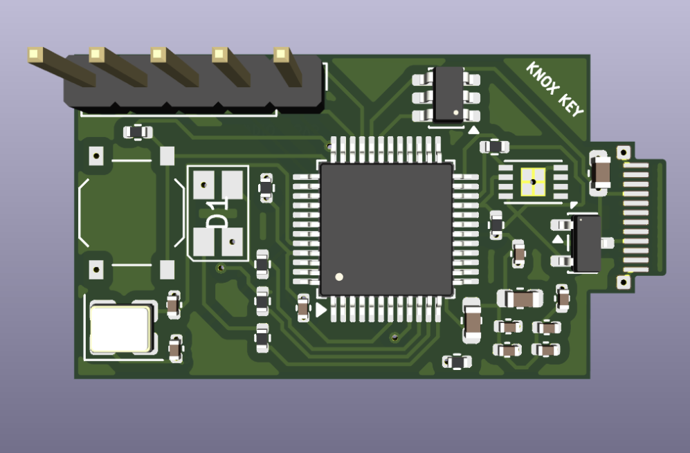
 |
| 90 | Set up CMake build system for firmware | 

Click to expand
Created CMake configuration files to set up the build system for STM32 firmware development. Configured the cross-compiler for ARM Cortex-M0, set up compiler flags, and configured the linker script for the STM32F072. Got the build system compiling a basic hello world successfully.  Evidence: 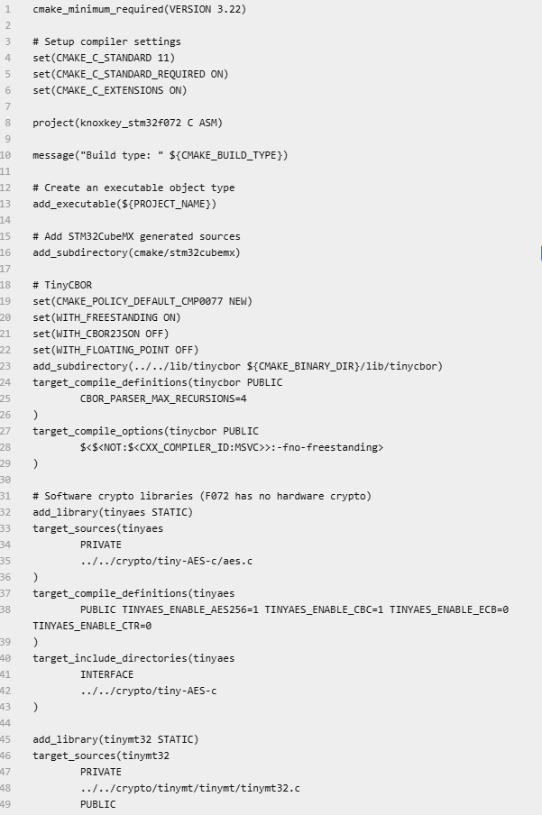
 |
| 60 | Configured STM32 USB device stack | 

Click to expand
Set up the STM32 HAL libraries for USB device operation. Configured USB device mode, set up the endpoint configuration, and defined basic USB descriptors. Got basic USB enumeration working - the device would show up as an unknown USB device on the computer.  Evidence: 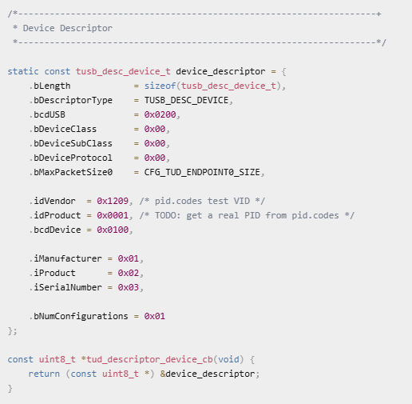
 |
| 45 | Started FIDO2 protocol implementation | 

Click to expand
Began implementing the FIDO2 protocol layer. Started with HID (Human Interface Device) support since FIDO2 typically uses HID for communication. Set up the HID report descriptors and basic command handling framework. Got to the point where I could receive commands from the host.  Evidence: 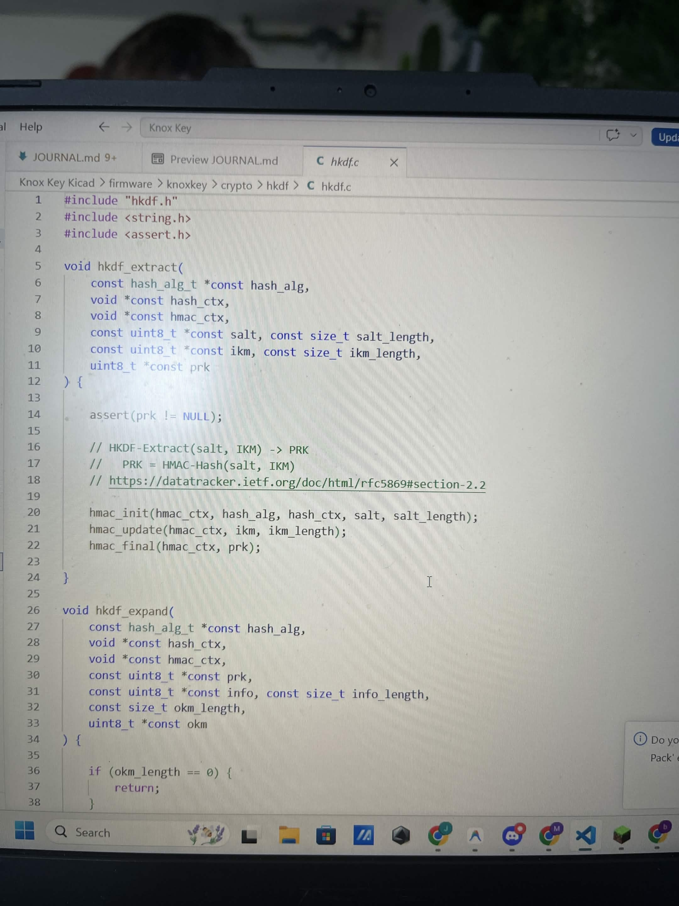
 |
| 30 | Basic command parsing and response | 

Click to expand
Implemented simple command parsing to extract FIDO2 commands from the USB HID reports. Set up the response mechanism to send results back to the host. Had the framework in place but not all the actual crypto operations yet.  Evidence: 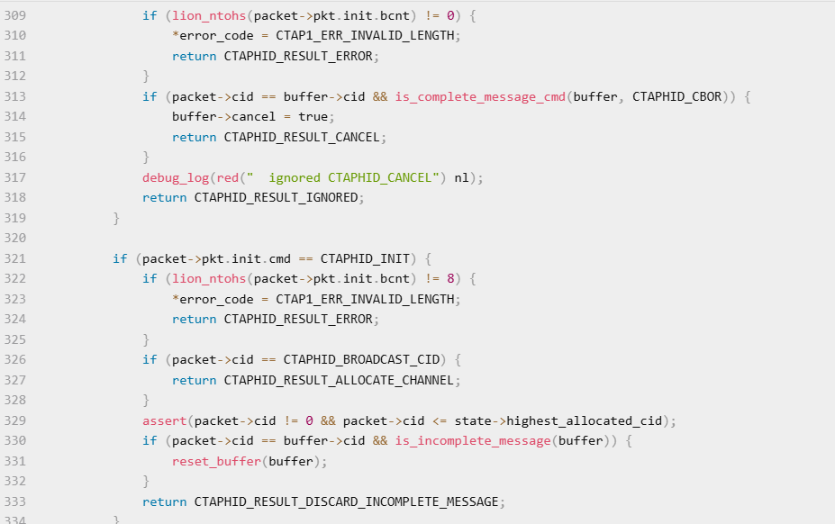
 |

