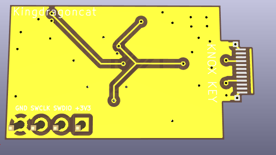
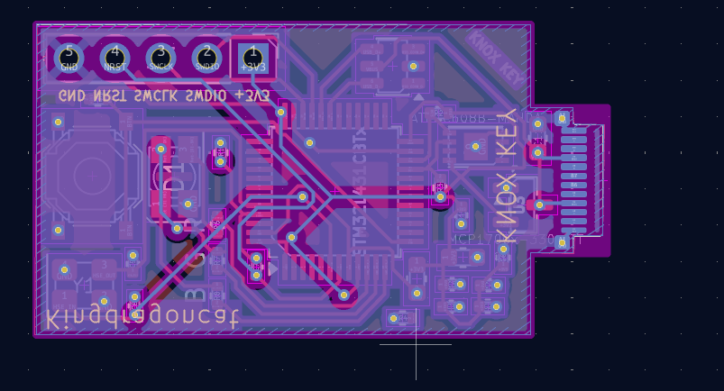
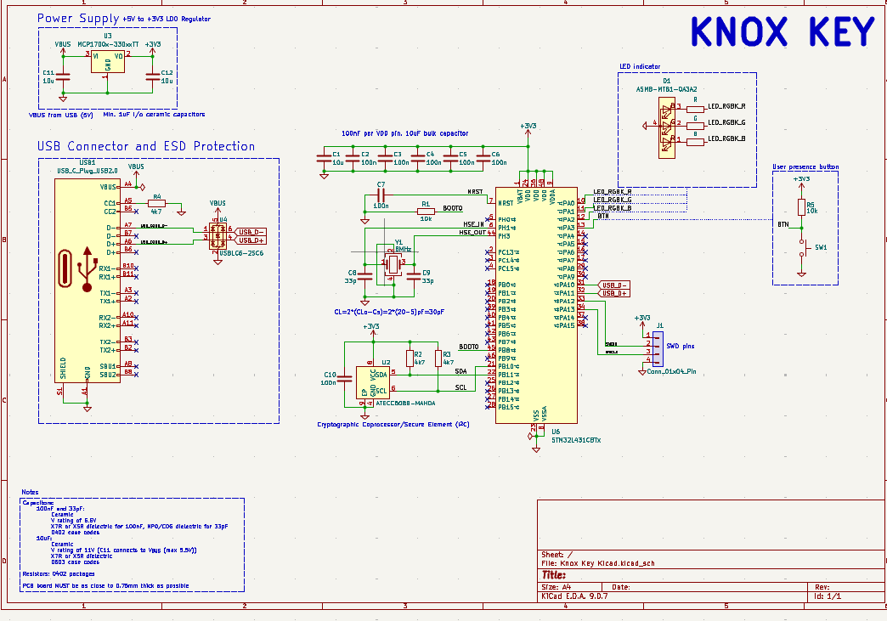

# Knox Key

This is a custom USB-C FIDO2 security key. The repository contains the KiCad 9 hardware files (schematics, PCB layout, fab outputs) and the authenticator firmware. 

The hardware pairs an STM32L433 microcontroller with an ATECC608B secure element. The project started out as an STM32F072 design (originally named "kryptonite") but was later reworked to use the L433.

## Hardware Details
* **MCU:** STM32L433CB (LQFP-48) with an 8 MHz crystal and internal USB PHY.
* **Crypto:** ATECC608B secure element on I2C (PB6/PB7) for hardware TRNG.
* **Port:** USB Type-C running USB 2.0 full speed.
* **Feedback:** Single RGB LED. Green is success, red is error, blue/yellow indicates waiting for user presence.
* **Button:** Tactile button for user presence verification (supports single, double, and long presses).
* **Power:** USB bus-powered via a 3.3V MCP1700 LDO.
* **PCB:** 2-layer layout.

## Working with KiCad
Open `Knox Key Kicad.kicad_pro` in KiCad 9. Make sure to run ERC and DRC before exporting manufacturing outputs. If you are hand-assembling the board, open `bom/ibom.html` in a web browser for the interactive BOM.

## Firmware
The firmware is in `firmware/knoxkey/` and implements a FIDO2 / CTAP2 authenticator. Random numbers are pulled from the ATECC608B over I2C, while credential wrapping uses software AES. User presence is verified via the hardware button.

To build the target for the STM32L433:
```bash
cd firmware/knoxkey
cmake -B build/stm32l433-release -S . --preset default -DBUILD_TARGET=stm32l433
cmake --build build/stm32l433-release -j 8
```
Binaries (`.elf`, `.hex`, `.bin`) will compile into `build/stm32l433-release/targets/stm32l433/`. Flash them using an ST-Link or via USB DFU mode.

## Bill of Materials
[`BOM.csv`](BOM.csv) and [`BOM.md`](BOM.md) at the repo root list every component, quantity, and LCSC part number. `manufacturing/bom.csv` has the same data in the exact format JLCPCB's assembly service expects.

## Manufacturing & Ordering
All files needed to manufacture the board are inside `manufacturing/`:
* `gerbers/` and `knox-key-gerbers.zip` — Bare-board fabrication files.
* `bom.csv` — Bill of Materials (with LCSC part numbers).
* `positions.csv` — Pick-and-place component coordinates (CPL).
* `designators.csv` — Reference designator mappings.
* `netlist.ipc` — IPC-D-356 netlist.

For JLCPCB: Upload `knox-key-gerbers.zip` for the PCB, and use `bom.csv` and `positions.csv` for SMT assembly. Add a solder paste stencil to your order if you plan to solder manually. Don't forget to regenerate these from KiCad if you modify the layout!

## Renders





## Security Warning
This is a hobbyist project and has not undergone any formal security audit. The ATECC608B chips ship unprovisioned, meaning you must load your own keys onto the secure element. Do not use this for production environments without reviewing the firmware and provisioning process yourself.

## License
GPLv3. See `LICENSE` for details.
