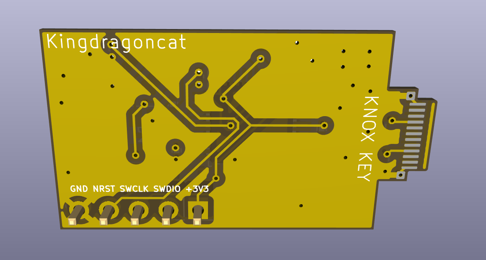

# Knox Key

A USB-C FIDO2 security key. This repo holds the KiCad 9 hardware design (schematic, PCB, manufacturing outputs) and the authenticator firmware.

The board pairs an STM32L433 with an ATECC608B secure element and exposes a single USB Type-C port. It started life as the "kryptonite" STM32F072 design and was reworked onto the L433.

## Hardware

- MCU: STM32L433CB (LQFP-48), 8 MHz crystal, internal USB full-speed PHY
- Secure element: ATECC608B on I2C (PB6/PB7), used as the hardware RNG
- Connector: USB Type-C, USB 2.0 full speed
- Status LED: RGB — green for success, red for error, blue/yellow while waiting
- User presence: tactile button (single, double, and long press)
- Power: USB bus powered, 3.3 V from an MCP1700 LDO
- 2-layer board

## Opening the project

Open `Knox Key Kicad.kicad_pro` in KiCad 9. Run ERC and DRC before exporting anything for manufacturing.

The interactive BOM (`bom/ibom.html`) opens in a browser and is handy for hand-assembly.

## Firmware

`firmware/knoxkey/` contains a FIDO2 / CTAP2 authenticator. Random numbers come from the ATECC608B over I2C; AES is done in software for wrapping stored credentials. User presence is the front button, with debouncing and single/double/long press handling. The RGB LED mirrors the FIDO state.

Build the STM32L433 target with CMake and `arm-none-eabi-gcc`:

```bash
cd firmware/knoxkey
cmake -B build/stm32l433-release -S . --preset default -DBUILD_TARGET=stm32l433
cmake --build build/stm32l433-release -j 8
```

The `.elf`, `.hex`, and `.bin` land in `build/stm32l433-release/targets/stm32l433/`. Flash over ST-Link or USB DFU.

## Manufacturing files

All outputs required for board fabrication and assembly are located in the `manufacturing/` directory:

- `gerbers/` and `knox-key-gerbers.zip` — Bare-board fabrication files.
- `bom.csv` — Bill of Materials with LCSC part numbers.
- `positions.csv` — Pick-and-place component coordinates.
- `designators.csv` — List of designators mapped to components.
- `netlist.ipc` — IPC-D-356 netlist file.

For a JLCPCB order, upload `knox-key-gerbers.zip` for PCB fabrication, then use `bom.csv` and `positions.csv` for SMT assembly. Turn on the stencil option if you want a paste stencil.

Regenerate these from KiCad after any layout change — the committed copies are only as current as the last export.

## Renders





## Security note

This is a hobbyist design, not an audited product. The ATECC608B ships unprovisioned — you have to load your own keys. Don't rely on it for anything serious without reviewing the firmware and provisioning the secure element yourself.

## License

GPLv3. See `LICENSE`.
